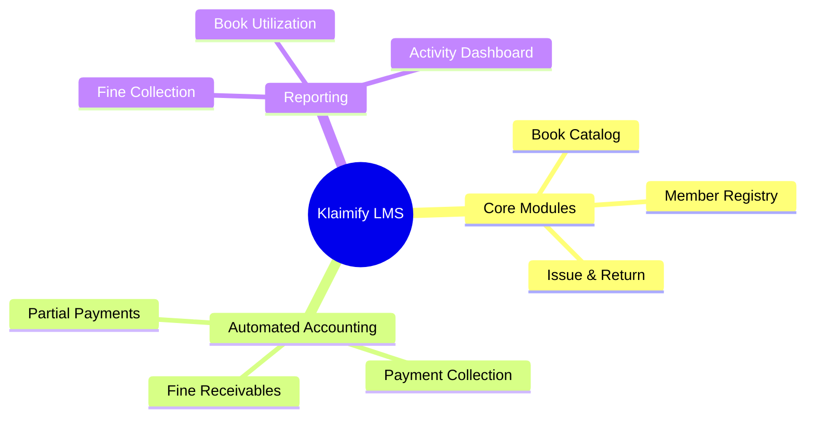
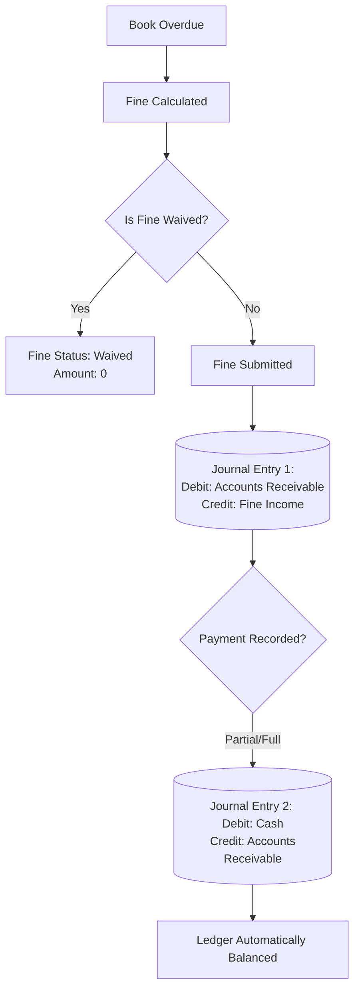

# 📚 Klaimify Library Management System (LMS)

[](https://frappeframework.com/)
[](#)
[](#)
[](https://opensource.org/licenses/MIT)

**Repository:** [github.com/kashyapram58-netizen/klaimify](https://github.com/kashyapram58-netizen/klaimify)

*Library Management System with Integrated Accounting for Frappe/ERPNext.*

---

## 1. System Overview
The Klaimify Library Management System (LMS) is a custom ERP solution designed to digitize and automate all core library operations within a single integrated platform. Built on the Frappe framework, this application eliminates manual data entry by seamlessly linking operational workflows (book cataloging, member registration, and book lending) with automated financial accounting and fine management.

### System Architecture


---

## 2. Core Modules & Technical Architecture

### 📖 Book Catalog Management

The system acts as a single source of truth for all books.

* **DocType (`Library Book` / `Library Book Copy`):** Maintains the registry (title, author, ISBN, category).
* **Automation:** Tracks total copies and updates real-time availability dynamically. Staff can easily search and filter the catalog.

### 👥 Member Management

Organizes all member records, history, and financial standing.

* **DocType (`Library Member`):** Registers students, staff, and public members.
* **Validations:** Tracks membership validity dates and restricts system privileges if a membership expires. It also provides an at-a-glance view of outstanding fines.

### 🔄 Book Issue & Return

A streamlined, error-free lending desk process.

* **DocType (`Library Transaction`):** Records the issuance and return of books.
* **Automation:** Sets automatic due dates based on configurable loan periods (defaulting to 14 days). The system performs pre-flight availability checks to prevent the issuance of unavailable books. Overdue statuses are updated automatically.

---

## 3. Automated Fine & Accounting Integration

The most powerful feature of the Klaimify LMS is its zero-manual bookkeeping architecture. Library staff do not need to perform any separate accounting entries; financial ledgers are updated in real-time via backend Python hooks.

### Accounting Automation Flow



| Feature | Technical Implementation |
| --- | --- |
| **Fine Calculation** | Fines are calculated automatically based on overdue days and a configurable rate. Authorized staff can process waivers. |
| **Fine Receivable Posting** | When a fine is submitted, a Journal Entry is created in the background. It debits `Accounts Receivable` and credits `Library Fine Income`. |
| **Payment Accounting** | Upon recording a payment, the system posts a secondary Journal Entry debiting `Cash` and crediting the receivable account. |
| **Partial Payments** | The Python backend accurately tracks partial payments against the total fine amount, leaving the remaining balance strictly as "Unpaid" or "Partially Paid" in the ledger. |

> **⚠️ Note to Administrators:** For the accounting automation to function, all referenced accounts (e.g., Cash, Fine Income) must be configured as **Ledger Accounts (leaf nodes)** in the ERPNext Chart of Accounts, not Group Accounts.

---

## 4. Reports & Dashboards

The system includes ready-made analytics to provide management with real-time operational visibility:

* 📊 **Fine Collection Report:** Tracks fines raised versus collected.
* 🕒 **Overdue Books Report:** Lists currently overdue materials and member details.
* 📈 **Member Activity Report:** Summarizes issue/return volume per member.
* 📚 **Book Utilization Report:** Identifies high-demand versus low-demand inventory.
* 💰 **Outstanding Fines Summary:** Dashboard view of total pending collections.

---

## 5. Role-Based Access Control

System access is strictly governed by user roles to ensure data integrity.

| Role | Permissions & Access |
| --- | --- |
| **Library Administrator** | Full access to catalog, members, configurations, and reports. |
| **Library Staff** | Can issue/return books, record payments, and view profiles. |
| **Accounts Staff** | View-only access to financial reports and fines; no catalog access. |
| **Management** | Read-only access to operational dashboards and reports. |

---

## 6. Installation

You can install this app using the [bench](https://github.com/frappe/bench) CLI:

```bash
# Navigate to your bench directory
cd $PATH_TO_YOUR_BENCH

# Get the app from the repository
bench get-app [https://github.com/kashyapram58-netizen/klaimify](https://github.com/kashyapram58-netizen/klaimify) --branch develop

# Install the app on your specific site
bench --site [your-site-name] install-app klaimify

# Migrate the database to ensure all custom DocTypes and fields are registered
bench --site [your-site-name] migrate

```

---

## 7. Contributing

This app uses `pre-commit` for code formatting and linting. Please [install pre-commit](https://pre-commit.com/#installation) and enable it for this repository:

```bash
cd apps/klaimify
pre-commit install

```

Pre-commit is configured to use the following tools for checking and formatting your code:

* `ruff`
* `eslint`
* `prettier`
* `pyupgrade`

---

## 8. License

This project is licensed under the **MIT** License.

```

```